<div align="center">


<br/>

### I build real products across **Full Stack · AI/ML · Web Engineering**

<p>
  <a href="https://github.com/rohanumbarepatil">
    
  </a>
  <a href="https://www.linkedin.com/in/rohan-umbare-patil-76b971358/">
    
  </a>
  <a href="https://rohan-protfolio-sepia.vercel.app/">
    
  </a>
  <a href="mailto:umbarepatilrohan@gmail.com">
    
  </a>
  <a href="https://x.com/RohanUpatil09">
    
  </a>
</p>

<p>
  
  &nbsp;
  
</p>

</div>

---

## About

I'm a **Computer Science Engineering student and full-stack developer** working across modern web development, AI/ML, and product-oriented engineering.

I enjoy taking ideas from **concept → implementation → working product**, with experience building full-stack applications, AI/ML-powered features, civic technology, productivity tools, and hackathon prototypes.

My strongest interests sit at the intersection of **software engineering, AI, and user experience**.

```typescript
const rohan = {
  role: "Full Stack Developer & AI Enthusiast",
  education: "B.E. CSE — Sanjay Ghodawat Institute",
  location: "Maharashtra, India",

  focus: [
    "Full Stack Development",
    "AI / ML",
    "Modern Web",
    "UI / UX",
    "Product Engineering"
  ],

  building: "AI-powered and real-world software products",

  openTo: [
    "Freelance",
    "Hackathons",
    "Open Source",
    "Collaborations"
  ]
};
````

---

## Engineering Stack

<table>
<tr>
<td valign="top" width="50%">

### Languages

`JavaScript` `Python` `Java`
`HTML5` `CSS3`

### Frontend

`React` `Next.js` `Tailwind CSS`

</td>

<td valign="top" width="50%">

### Backend & Data

`Node.js` `Express` `Firebase` `MongoDB`

### AI / ML

`scikit-learn` `Pandas` `NumPy` `OpenAI API`

</td>
</tr>
</table>

### Tools

<p>


</p>

---

## Selected Projects

<table>
<tr>

<td width="50%" valign="top">

### Arogya360
**Smart Health Management System**

A civic-health platform built around hospital-resource monitoring and health-management workflows, combining a React/Firebase application with an ML-oriented fraud-detection component.

**Stack**

`React` `Node.js` `JavaScript` `Firebase`

<br/>

<a href="https://github.com/rohanumbarepatil/Smart-Health-Care-System">

</a>
&nbsp;
<a href="https://smart-health-system-e3411.web.app/">

</a>

</td>

<td width="50%" valign="top">

### TechPravartan 2025 MVP
**1st Place · 24-Hour Hackathon**

A full-stack web platform developed from scratch under a 24-hour hackathon constraint, combining frontend development, REST APIs, and rapid product iteration.

**Stack**

`React.js` `JavaScript` `Tailwind CSS` `REST APIs`

<br/>

**Recognition:** 🥇 1st Place Winner

</td>

</tr>

<tr>

<td width="50%" valign="top">

### AIML Nexus
**Gamified AI/ML Education Platform**

An interactive learning platform combining quizzes, a Python playground, mini-games, an AI tutor, and progress tracking, developed for the Vibethon hackathon.

**Stack**

`React` `Firebase` `Tailwind CSS` `OpenAI API`

<br/>

<a href="https://github.com/Sanket-010s/vibethon-TeamSparten-spot11">

</a>
&nbsp;
<a href="https://vibethon-teamsparten-spot11.web.app/auth">

</a>

</td>

<td width="50%" valign="top">

### Employee Management System
**Java Full-Stack Application**

A full-stack application focused on employee-management workflows, RESTful APIs, database interaction, and backend development.

**Stack**

`Java` `Spring Boot` `MySQL` `JavaScript` `REST APIs`

</td>

</tr>

<tr>

<td width="50%" valign="top">

### Nexora iGAP
**Digital Experience Platform**

A marketing website developed for **iGAP Technologies Pvt. Ltd.**, presenting its AI, data-science, software-development, project, and academy offerings.

**Stack**

`HTML5` `CSS3` `Vanilla JavaScript`

<br/>

<a href="https://github.com/Sanket-010s/NEXORA---iGAP-website-">

</a>
&nbsp;
<a href="https://nexora-i-gap-website.vercel.app/">

</a>

</td>

<td width="50%" valign="top">

### Ghabit
**Offline-First Productivity Suite**

A lightweight productivity web application combining habit tracking, task management, day planning, Pomodoro sessions, and goal countdowns.

**Stack**

`HTML5` `CSS3` `Vanilla JavaScript` `Express.js` `LocalStorage`

<br/>

<a href="https://github.com/rohanumbarepatil/Ghabit">

</a>
&nbsp;
<a href="https://rohanghabit.netlify.app/todolist.html">

</a>

</td>

</tr>
</table>

<div align="center">

<a href="https://github.com/rohanumbarepatil?tab=repositories">
<strong>View all repositories →</strong>
</a>

</div>

## Experience & Community

<table>
<tr>

<td width="50%" valign="top">

### Java Full Stack Developer Intern
**Kinetrexa Software Pvt. Ltd.**

`Jun 2026 – Jul 2026`

Worked on full-stack software development using **Java, Spring Boot, and MySQL**, contributing to backend services, REST API development, database workflows, responsive interfaces, Git-based development, and software-engineering practices.

</td>

<td width="50%" valign="top">

### Official Campus Ambassador
**Techfest, IIT Bombay**

`Jun 2026 – Present`

Participating in technical-event outreach and student engagement as an official college ambassador for **Techfest, IIT Bombay**.

</td>

</tr>

<tr>

<td width="50%" valign="top">

### Data Science Intern
**Cognifyz Technologies**

Worked on **data-science and machine-learning related development**, including ML workflows and data analysis.

</td>

<td width="50%" valign="top">

### Campus Mantri
**GeeksforGeeks**

Representing the student developer community and supporting **coding, technical learning, and student-engagement initiatives**.

</td>

</tr>

<tr>

<td width="50%" valign="top">

### Student Partner
**Internshala**

Contributed to **campus-level student outreach** and awareness around internship and learning opportunities.

</td>

<td width="50%" valign="top">

### CSESA
**Sanjay Ghodawat Institute**

Contributing to **technical-community activities, event coordination, and student engagement** within the Computer Science & Engineering community.

</td>

</tr>

<tr>

<td width="50%" valign="top">

### Technoverse Techfest 2026

Technical event organization and coordination through **CSESA**, contributing to the execution of a student-focused technical festival.

</td>

<td width="50%" valign="top">

### Hackathon Builder

Building and presenting software products under **short development timelines**, including full-stack and AI/ML-oriented projects.

</td>

</tr>
</table>

---

## Recognition

<div align="center">

| Recognition / Achievement | Organization / Event | Details |
|:---|:---|:---|
| 🥇 **1st Place Winner** | TechPravartan 2025 | 24-hour Hackathon |
| 🏆 **National Finalist** | HackAura 2026 | 4-person Engineering Team |
| 📣 **Official College Ambassador** | Techfest, IIT Bombay | Student Outreach & Engagement |
| 💻 **Java Full Stack Developer Intern** | Kinetrexa Software Pvt. Ltd. | Jun 2026 – Jul 2026 |
| 🤝 **Campus Mantri** | GeeksforGeeks | Student Developer Community |
| 🎓 **Student Partner** | Internshala | Campus Student Outreach |

</div>

---

## GitHub Overview

<div align="center">

<picture>
  <source media="(prefers-color-scheme: dark)" srcset="./profile/stats.svg">
  <source media="(prefers-color-scheme: light)" srcset="./profile/stats.svg">
  
</picture>

<picture>
  <source media="(prefers-color-scheme: dark)" srcset="./profile/top-langs.svg">
  <source media="(prefers-color-scheme: light)" srcset="./profile/top-langs.svg">
  
</picture>

<br/><br/>

<picture>
  <source
    media="(prefers-color-scheme: dark)"
    srcset="https://raw.githubusercontent.com/rohanumbarepatil/rohanumbarepatil/output/activity-graph.svg"
  />
  <source
    media="(prefers-color-scheme: light)"
    srcset="https://raw.githubusercontent.com/rohanumbarepatil/rohanumbarepatil/output/activity-graph.svg"
  />
  
</picture>

</div>

---

## Education

<div align="center">

| Degree                                    | Institution                                             |    Period   |   Score |
| :---------------------------------------- | :------------------------------------------------------ | :---------: | ------: |
| **B.Tech · Computer Science Engineering** | Sanjay Ghodawat Institute, Kolhapur                     | 2024 – 2028 | Current |
| **12th Grade · PCM**                     | Walchand College Of Arts And Science, Solapur           | 2022 – 2024 |   60.2% |
| **10th Grade · SSC**                      | Vasantrao Gopinath Patil High School Nanduri, Tulajapur | 2023 – 2024 |  89.80% |

</div>

---

## What I Care About

<table>
<tr>
<td width="33%" align="center">

### Build

Real products over
toy implementations.

</td>

<td width="33%" align="center">

### Learn

AI/ML, modern web
and deeper engineering.

</td>

<td width="33%" align="center">

### Ship

Turn ideas into
working experiences.

</td>
</tr>
</table>

---

<div align="center">

### Let's build something useful.

<br/>

<a href="https://rohan-protfolio-sepia.vercel.app/">

</a>
&nbsp;
<a href="mailto:umbarepatilrohan@gmail.com">

</a>
&nbsp;
<a href="https://www.linkedin.com/in/rohan-umbare-patil-76b971358/">

</a>

<sub>Full Stack Development · AI/ML · Product Engineering</sub>

</div>

---

